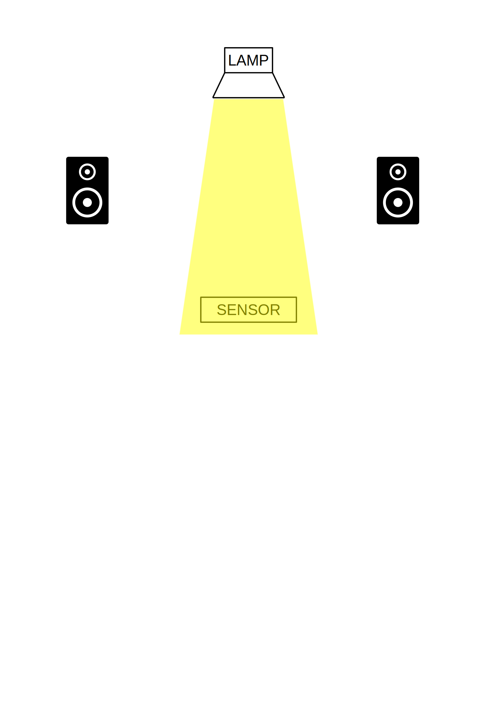
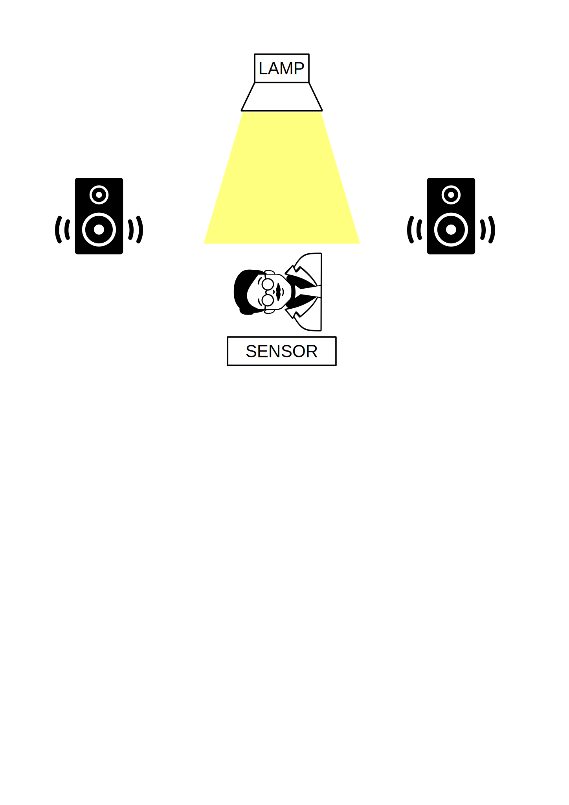

# INSTALLAZIONE INTERATTIVA

---

# forma artistica in cui `MEDIA` diversi occupano uno spazio comune

--

# E DOVE LO SPETTATORE È INTERAGISCE CON I MEDIA

---

# costruiremo un dispositivo in grado di `SENTIRE` la luce nell'ambiente...

--

# una lampada proietta un fascio luminoso su un sensore

--

---

# Quando la luminosità cambia, grazie all'intervento di uno spettatore

--

--

# ...vengono `INNESCATI` DEGLI `EVENTI`

--

# `SUONI` E `VOCI` REGISTRATE...
# ...CHE LEGGONO E RECITANO PAROLE E FRASI SUL TEMA DELLA`LUCE` {: .fragment}

---

# 
 luminoso 

## 
 ombra 

### 
 silhouette 

# 
 calore 

##### 
 fredda 

### 
 kelvin 

# 
 ... 

---

# COSTRUIREMO DIVERSE `POSTAZIONI` NELLO SPAZIO

---

# OGNUNA DELLE QUALI COMPOSTA DA UNA `FOTORESISTENZA`
 {: .fragment}

--

# CHE MISURERÀ LA QUANTITÀ DI LUCE PRESENTE SULLA SUA SUPERFICIE
# E INVIERÀ TALE VALORE A UNA SCHEDA ARDUINO

--

# CHE SI OCCUPERÀ DI ELABORARE IL SEGNALE E DI INVIARLO A UN COMPUTER

---

# DOVE IL SOFTWARE `PUREDATA` SI OCCUPERA' DI GESTIRE LE NOSTRE VOCI E I NOSTRI SUONI

--

---

# FLUSSO DI LAVORO

---

# Testi 
1. scelta e compilazione {: .fragment}
2. registrazione {: .fragment}
3. editing e pulizia con `ocenaudio` {: .fragment}
4. sequencing {: .fragment}

---

# Arduino
1. Costruzione del dispositivo (cavi, fotoresistenze, *inscatolamento*) {: .fragment}
2. Scrittura del codice (Arduino IDE) {: .fragment}

---

# Suoni
1. Che suoni? {: .fragment}
2. Costruzione della *patch* con `puredata` {: .fragment}

---

# Parte meccanica e assemblaggio
1. Costruzione {: .fragment} 
2. Collegamento di tutte le parti {: .fragment}
3. Messa in moto! {: .fragment}
