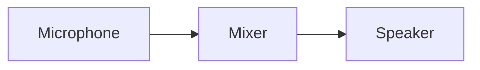
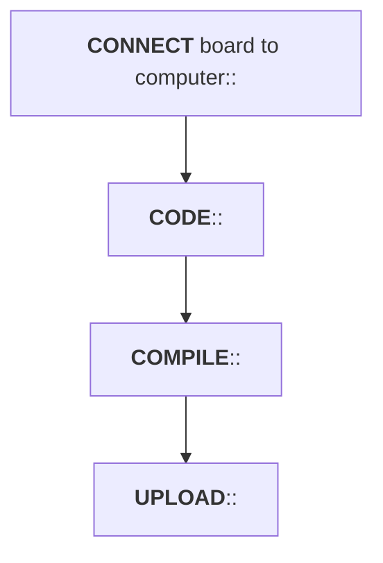
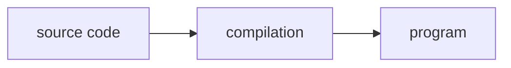

---

theme: "white"
transition: "slide"
transitionSpeed: "slow"
slideNumber: false
overview: false
previewLinks: false
controls: true
dataState: "no-title-footer"

---

<style>
    .reveal code {
        background-color: #66b3ff;
        color: #000000;
        padding: 0.2em 0.25em 0.2em 0.25em;
    }

    #title-footer {
        display: none;
    }
</style>

<script>
    mermaid.initialize({ theme: 'neutral' })
</script>

# Arduino ```workflow```

---

- An arduino board is a (little) computer
- it can be only receive, process and send electrical signals
- exactly like a traditional computer

---

### ```input``` and ```output``` devices can be connected to a computer

---

- input: mouse, trackpad, keyboard
- output: monitor, printer
---


---

### also the electroacoustic chain offers the same model



---

### for microcontrollers it is more commonly referred to as ```sensors``` (input) and ```actuators``` (output)

---


---

### systems involving microcontrollers, sensors and actuators belong to the area of ​​```physical computing```

---

# software

---

### arduino is not designed *a priori* to perform a given task
### a ```program``` must be uploaded into the board

---

### a program is a sequence of instructions that contribute to the resolution of a problem, or more generally, to the execution of a ```task```

---

### arduino runs programs that are ```uploaded``` into its microcontroller

---

### the steps to upload a program are:



---

### these steps can be realized by ```arduino IDE```

---


---

# the language of arduino

---

- the only language arduino speaks is based on 2-symbols alphabet: 0 and 1
- these symbols belongs to binary numeric system
- long sequences of these symbols shape instructions for microcontroller

---

- every internal component is configured by binary instructions
- if I would set pin number 8 as an OUTPUT pin, I could code: 00001000 00000001
- this language is called ```machine code```  

---

- theorically I could program the board using machine code
- but programming arduino (or other computer) using that is a complex, tiring and boring task
- *ATMega328* (arduino microcontroller) instruction manual is 300 pages long (and very DENSE pages!) 

---

- a programming language is generally used
- you write the ```source code``` (called ```sketch``` in arduino) with this language
- then you pass the source code to a software called ```compiler``` that translates it in machine code  



---

#### a programming language is closer to the natural language and more abstract then hardware

#### this abstraction allows to ```generalize```, that is compile the same source code for different microcontrollers

---


---

#### the programming language used in arduino is C/C++, with a specified ```library``` written to facilitate coding

##### C programming language is composed by a set of about 30 words, then it's concise

---

### sketch


---

### compiled sketch


---

# ```sketch``` anatomy

---

- Each sketch consists of the **definition** of *at least* two functions (instruction blocks), which are **always** present:
  - **setup()**: defines preliminary operations (pin configuration, serial port, and so on...)
  - **loop()**: run programmed task, repeatedly, until the board is powered on

---

### sketch skeleton


---

### when arduino turn on, it executes setup() function (only once), then, ```repeatedly``` executes the loop() function 

---

# the first sketch

### turn on the builtin led

---

### task

- write a program the turn on the led for one second, then turn off the led for one second and start again this task

---

### overview

- builtin led of arduino Uno is connected to pin 13
- we  will set pin 13 as OUTPUT
- ...and then we will apply a voltage on that pin
- a HIGH voltage value will turn on the led, a LOW value will turn it off

---

### ...express the algorithm in natural language


---

##### in a C porogram: 
- a line preceded by double slash (```//```) is a comment
- a block of code (multi line) preceded by ```/*``` and followed by ```*/``` is a comment
- a comment is ignored by compiler; it's just a note used by developer to describe the code

```c++
// I'm a single line comment
/*
    I'm a 
    multi-line
    comment
*/
```

---

### sketch in c

---
  
<!-- .slide: data-transition="slide-in fade-out" -->


---

<!-- .slide: data-transition="fade-in fade-out" -->


---

<!-- .slide: data-transition="fade-in fade-out" -->


---

<!-- .slide: data-transition="fade-in fade-out" -->


---

<!-- .slide: data-transition="fade-in fade-out" -->


---

<!-- .slide: data-transition="fade-in fade-out" -->


---

<!-- .slide: data-transition="fade-in fade-out" -->


---

<!-- .slide: data-transition="fade-in fade-out" -->


---

<!-- .slide: data-transition="fade-in fade-out" -->


---

<!-- .slide: data-transition="fade-in fade-out" -->


---

<!-- .slide: data-transition="fade-in fade-out" -->


---

### what arduino does


---

